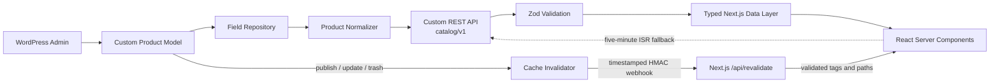
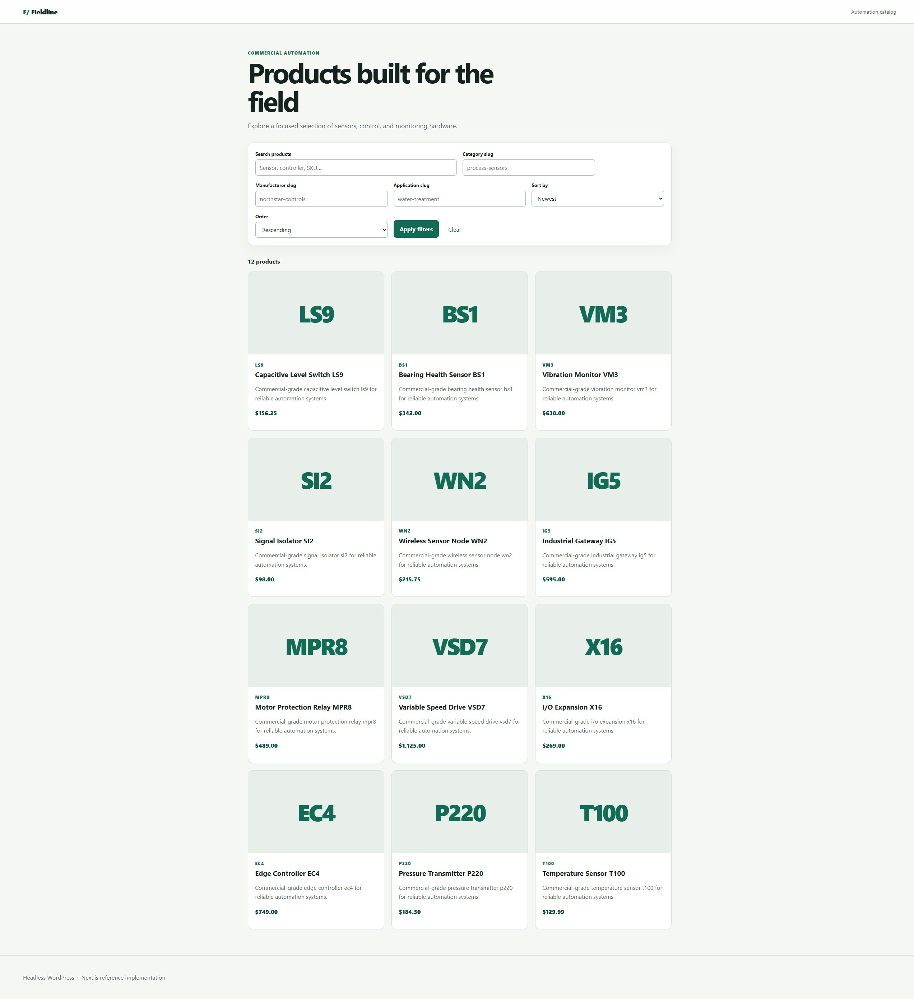
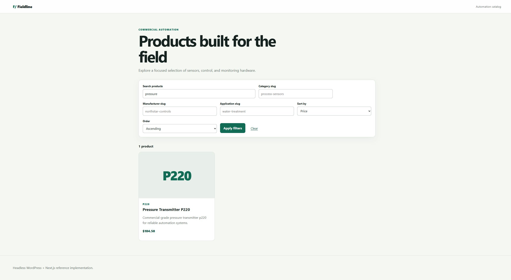
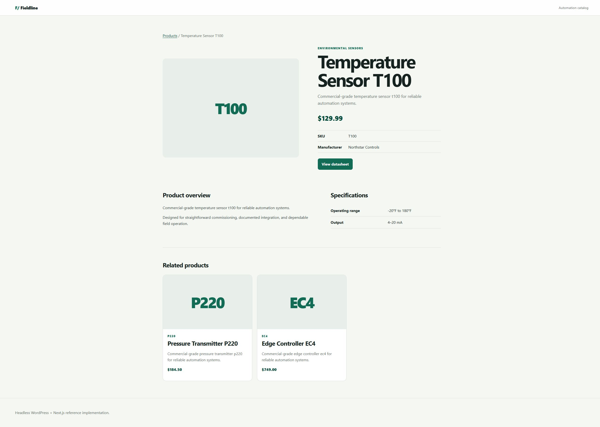
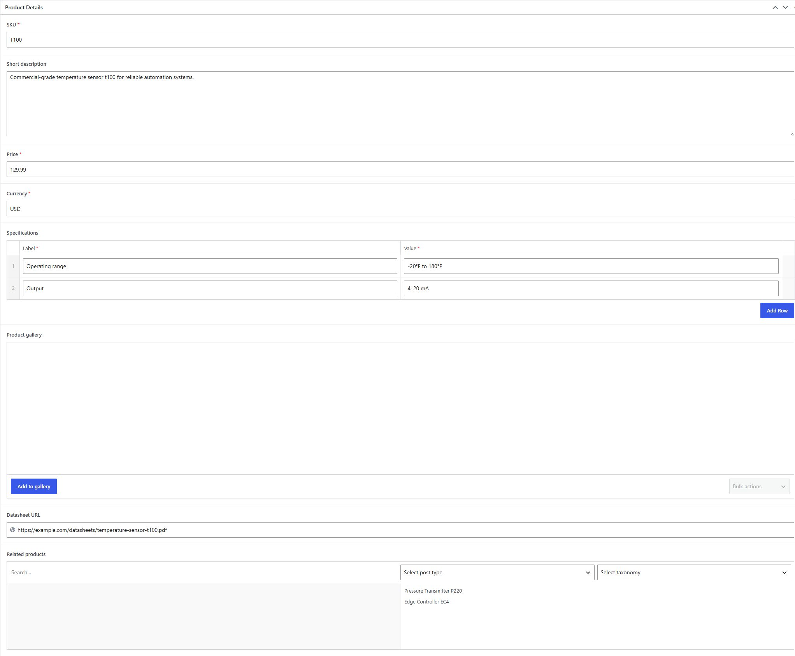
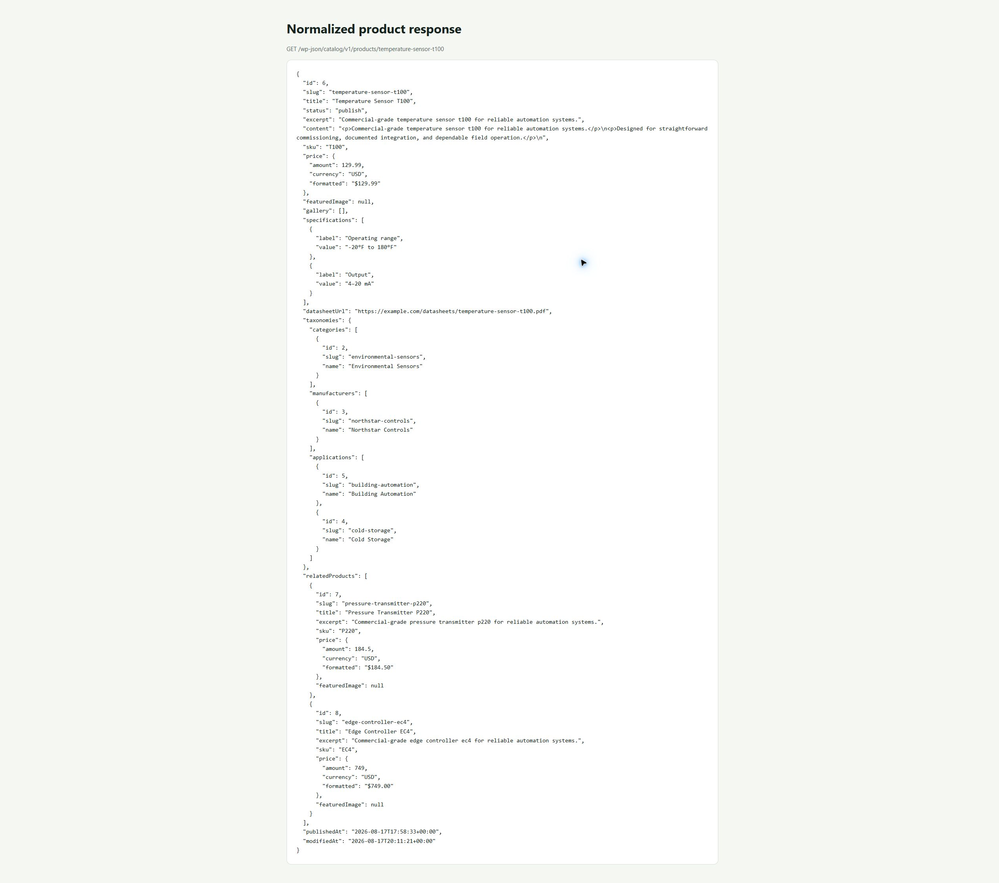

# Headless WordPress + Next.js Product Catalog

A sanitized, portfolio-quality code sample showing WordPress as a headless content source for a typed Next.js catalog. The repository favors a stable contract, secure editorial workflows, and reproducible verification over visual complexity. It is deliberately not a store: there is no cart, checkout, payment, inventory, or WooCommerce dependency.

## Project purpose

This project demonstrates:

- custom WordPress product modeling with plugin-owned fields and taxonomies;
- a normalized, versioned REST API instead of raw `WP_Post` or ACF payloads;
- a typed WordPress-to-Next.js data contract with Zod runtime validation;
- server rendering, shareable URL-driven filtering, sorting, and pagination;
- server-to-server draft preview protected by a timing-safe secret and WordPress capabilities;
- signed on-demand revalidation with five-minute ISR as a recovery path;
- canonical metadata, Open Graph output, and escaped Product JSON-LD;
- an accessible, responsive interface built primarily with Server Components.

## Architecture overview



`Field_Repository` isolates ACF storage, `Product_Normalizer` owns the public PHP boundary, and the Zod schemas in `frontend/lib/schemas.ts` form the runtime boundary before React receives data. See [Architecture](docs/architecture.md) and [API contract](docs/api-contract.md).

## Screenshots

| Production catalog | URL-driven filtering |
| --- | --- |
|  |  |

| Product detail | ACF Pro editing UI |
| --- | --- |
|  |  |



## Most challenging implementation areas

1. **Keeping the contract stable while fields evolve.** `Field_Repository` (`includes/class-field-repository.php`) separates storage from `Product_Normalizer` (`includes/class-product-normalizer.php`). ACF return formats can change without silently changing the REST representation.
2. **Normalizing heterogeneous CMS values.** The normalizer converts attachment IDs or arrays into public image objects, `WP_Term` instances into `{id, slug, name}`, repeater rows into specification pairs, and relationship values into deliberately non-recursive product summaries.
3. **Previewing unpublished content without leaking credentials.** `frontend/app/api/preview/route.ts` validates its entry secret in constant time, then `fetchProduct(..., true)` uses server-only Application Password credentials. `REST_Controller::single()` still requires `current_user_can( 'edit_post', $id )` before returning a draft.
4. **Avoiding stale pages without broad cache purges.** `Cache_Invalidator` advances a WordPress cache generation and signs a targeted webhook. `/api/revalidate` checks the timestamp, HMAC, tags, and paths before invalidating Next.js data. Time-based ISR limits staleness if delivery fails.
5. **Making filters work during SSR and progressive enhancement.** `CatalogFilters` is a normal GET form and pagination uses ordinary links. `app/products/page.tsx` parses known query keys server-side, so filtered states remain bookmarkable and usable without JavaScript.
6. **Stopping CMS schema drift at the data layer.** `frontend/lib/wordpress.ts` parses every external response with the Zod schemas before returning it. Components never accept raw WordPress response types.

## Quick start

### Requirements

- WordPress 6.5+, PHP 8.1+, WP-CLI, and Composer
- **Advanced Custom Fields Pro** installed separately (not redistributed here)
- Node.js 20.9+ and npm

The plugin is designed for ACF Pro and can also operate with compatible field APIs where available. ACF Pro remains the primary supported authoring dependency for this code sample.

### Install WordPress plugin

Copy or symlink `wordpress-plugin/headless-product-catalog` into the target site's `wp-content/plugins` directory, then run:

```bash
wp core is-installed --path=/path/to/wordpress
wp plugin activate headless-product-catalog --path=/path/to/wordpress
wp rewrite flush --path=/path/to/wordpress
wp catalog seed --path=/path/to/wordpress
```

The seed command creates twelve fictional automation products and supporting terms. It only updates records marked with `_hpcatalog_seed_source=headless-catalog-demo-v1`, never deletes content, and is safe to repeat.

### Run Next.js

```bash
cp .env.example frontend/.env.local
cd frontend
npm ci
npm run dev
```

Update `frontend/.env.local` with the actual local WordPress API and frontend origins. Never commit that file.

### Run checks

```bash
cd frontend
npm test
npm run lint
npm run typecheck
npm run build
npm audit
```

```bash
cd wordpress-plugin/headless-product-catalog
composer install
composer validate --strict
composer lint
composer audit
WP_TESTS_DIR=/path/to/wordpress-tests-lib composer test
```

The last command additionally requires the official WordPress PHPUnit library and an isolated disposable test database.

## Repository map

| Path | Responsibility |
| --- | --- |
| `wordpress-plugin/headless-product-catalog` | Product model, PHP field definitions, normalized REST API, cache invalidation, webhook, seed command, and PHP tests |
| `frontend` | Next.js App Router application, typed API client, Zod schemas, UI components, API handlers, and frontend tests |
| `docs/api-contract.md` | Exact public response shapes, examples, nullability, errors, and versioning policy |
| `docs/architecture.md` | Published, preview, and revalidation flows with security boundaries and tradeoffs |
| `docs/implementation-report.md` | Evidence-based summary of the completed implementation and checks |
| `.env.example` | Variable names and safe placeholder values; no credentials |
| `.github/workflows` | Reproducible frontend and PHP CI checks |

## Public API

```text
GET /wp-json/catalog/v1/products
GET /wp-json/catalog/v1/products/{slug}
```

The collection accepts `page`, `per_page`, `search`, `category`, `manufacturer`, `application`, `sort`, and `order`. Values are sanitized and validated; sorting is mapped through an explicit allow-list. The public collection always forces `post_status=publish`.

## Environment variables

| Variable | Visibility | Purpose |
| --- | --- | --- |
| `WORDPRESS_API_URL` | Server only | Complete catalog namespace, for example `https://wordpress.example.test/wp-json/catalog/v1` |
| `WORDPRESS_APPLICATION_USERNAME` | Server only | Least-privilege WordPress preview user |
| `WORDPRESS_APPLICATION_PASSWORD` | Server only | WordPress Application Password; never a login password |
| `NEXT_PUBLIC_SITE_URL` | Public | Canonical frontend origin |
| `PREVIEW_SECRET` | Server only | Protects entry to Next.js Draft Mode |
| `REVALIDATION_SECRET` | Server only | HMAC key shared with WordPress |

Generate independent high-entropy secrets in the deployment secret manager. Application code fails clearly when required public origins are missing rather than silently using a local or production fallback.

## Preview workflow

1. Create a least-privilege WordPress user that can edit catalog products and issue an Application Password.
2. Configure the username, Application Password, and `PREVIEW_SECRET` in Next.js.
3. Request `/api/preview?secret=...&slug=product-slug` from the editorial integration.
4. Next.js timing-safely validates the secret and authenticates to WordPress over HTTPS from the server.
5. WordPress returns an unpublished record only if the authenticated user can edit that specific post.
6. Next.js enables Draft Mode and redirects to the product page.

The browser never receives WordPress credentials. Direct public requests for unpublished products return the same `404` as missing products.

## Revalidation workflow

Configure these on WordPress through environment-backed constants:

```php
define( 'HPCATALOG_REVALIDATION_URL', 'https://catalog.example.test/api/revalidate' );
define( 'HPCATALOG_REVALIDATION_SECRET', getenv( 'REVALIDATION_SECRET' ) );
```

On product changes, WordPress posts an exact JSON body with a timestamp and `HMAC-SHA256(secret, timestamp + "." + body)`. Next.js rejects expired timestamps, invalid signatures, malformed bodies, and non-catalog tags or paths. The request is intentionally non-blocking; five-minute ISR is the recovery mechanism when a webhook is lost.

## Security decisions

- Drafts require both authenticated WordPress identity and per-post edit capability.
- REST arguments have explicit types, ranges, length limits, sanitizers, and an allow-listed sort map.
- API responses contain a purpose-built contract, not raw posts, arbitrary metadata, authors, or filesystem paths.
- WordPress applies `wp_kses_post()` and Next.js applies a second explicit HTML tag/attribute allow-list.
- Preview credentials and secrets are server-only and never use a `NEXT_PUBLIC_` prefix.
- HMAC comparison is timing-safe and the five-minute timestamp window limits replay.
- Revalidation tags and paths are syntax- and route-constrained before cache APIs are called.
- The plugin adds no custom administrative write action, so it introduces no additional nonce-protected form surface.

## Verification status

### Passed locally

- ACF Pro 6.8.6 active with Secure Custom Fields disabled during the final verification pass
- PHP syntax checks for all plugin and test PHP files
- WordPress Core and Extra coding standards
- Strict Composer manifest validation and dependency audit with no advisories
- WP-CLI seed and repeat seed: twelve generated records, no duplicates
- Live collection, detail, invalid-parameter, missing-product, public-draft, and cache-hit checks
- Frontend unit/component tests: six tests across three files
- ESLint, Prettier, and strict TypeScript checks
- Next.js 16.3.1 production build
- npm dependency audit: no vulnerabilities
- End-to-end production-server smoke tests for listing, filtering, detail, signed revalidation, and preview rejection against the real local WordPress API
- Repository and existing Git history secret/private-data scan

### Passed in GitHub Actions

- Frontend tests, ESLint, Prettier, TypeScript, production build, and npm audit
- PHP syntax, strict Composer validation, WordPress coding standards, and Composer audit
- PHPUnit integration suite against WordPress 7.0 and an isolated MySQL 8.4 test database

### Local PHPUnit note

PHPUnit was not executed against the Windows development database because the official WordPress PHPUnit environment was unavailable locally. The same committed suite passed in GitHub Actions using the official WordPress test library and a disposable database. Local PHP syntax, coding standards, and live REST integration checks passed independently.

## Deployment

1. Install ACF Pro and this plugin on WordPress; configure clean permalinks and trusted HTTPS.
2. Do not seed production unless fictional demonstration content is desired.
3. Deploy `frontend` to a Node-compatible host with every environment variable configured in its settings UI.
4. Configure the WordPress webhook URL/key and a least-privilege Application Password account.
5. Verify media delivery, collection/detail responses, draft preview, publish-triggered invalidation, canonical metadata, and JSON-LD on the deployed origins.

## Known limitations

- ACF Pro is a licensed dependency and is not bundled.
- Text-based taxonomy slug filters avoid adding a separate taxonomy-discovery endpoint.
- Prices are display-only; there is no inventory, localization, or transactional behavior.
- Webhook delivery is non-blocking and has no persistent retry queue; ISR provides eventual recovery.
- The local machine did not have isolated WordPress PHPUnit infrastructure; the committed suite passed in CI against a disposable MySQL database.
- No hosted demo is provided; the immediate deliverable is a reproducible, reviewable code sample.
