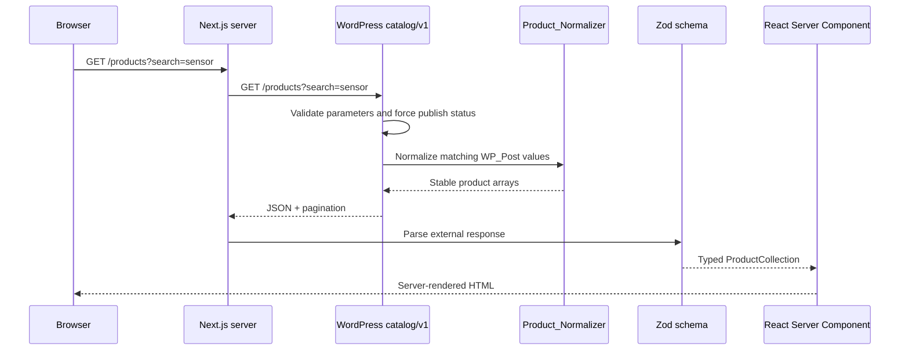
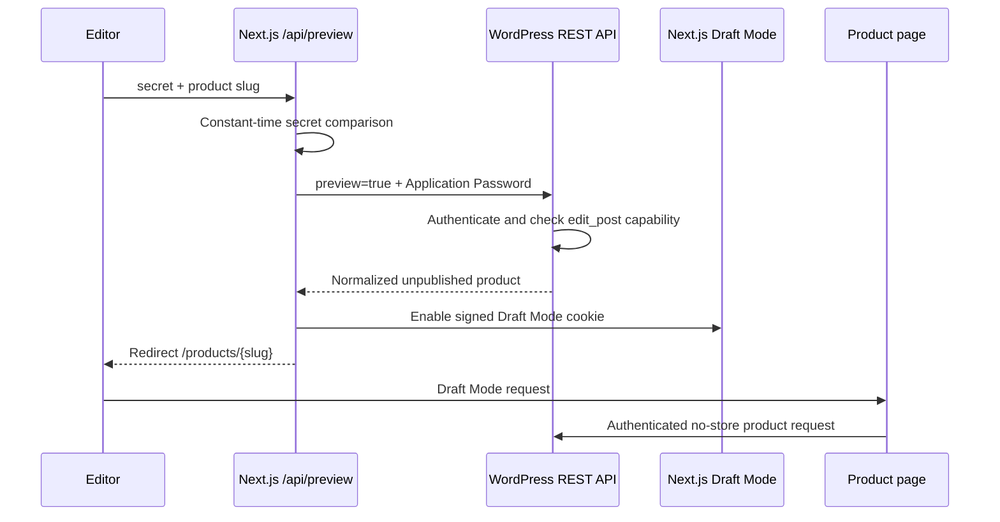
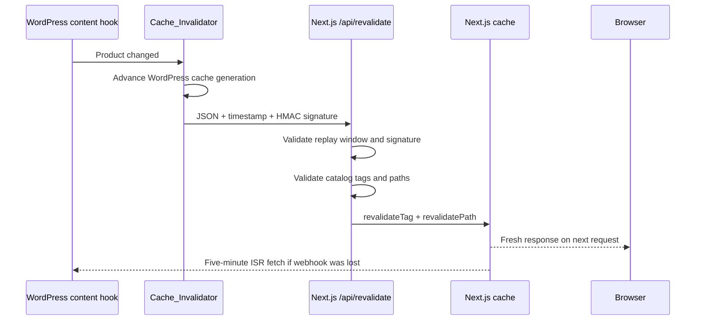

# Architecture

## Components and boundaries

- `Product_Post_Type` owns the prefixed post type and taxonomies.
- `ACF_Fields` registers the ACF Pro editing model in PHP.
- `Field_Repository` isolates ACF-compatible reads and writes from consumers.
- `Product_Normalizer` converts WordPress values into the public v1 contract.
- `REST_Controller` validates requests, builds allow-listed queries, and returns normalized responses.
- `frontend/lib/wordpress.ts` performs external I/O and Zod parsing.
- React Server Components consume only inferred TypeScript contract types.

WordPress/ACF is the editorial boundary, the PHP normalizer is the publication boundary, and Zod is the frontend trust boundary.

## Published request

Invalid parameters are rejected before `WP_Query` is built. The normalizer omits internal fields rather than asking the frontend to filter them. Non-2xx responses become `CatalogApiError` instances, and schema drift throws at the Zod boundary before malformed data reaches a component. The route error boundary presents an accessible recovery action.

## Stable contract over evolving ACF fields

ACF fields can change return formats independently of stored values. `Field_Repository` centralizes access, while `Product_Normalizer` handles ID/array/object variants and emits one shape. Media becomes public URL/alt/dimensions, taxonomies become term summaries, specifications become label/value pairs, and relationships become non-recursive product summaries.

This separation makes an editorial migration a PHP boundary change rather than a coordinated rewrite of UI components. Breaking public changes use a new REST namespace instead of silently altering `catalog/v1`.

## Draft preview

The preview secret and WordPress credentials are server-only. The secret comparison uses `timingSafeEqual` and rejects unequal lengths. WordPress, not Next.js, is the final authority for access to a specific draft. Draft reads use `cache: no-store`, and unauthorized or nonexistent drafts both return `404`.

Tradeoff: the preview secret is transported as a query parameter for compatibility with editorial preview links. It must be high entropy, restricted to trusted workflows, and protected by HTTPS; access logs should be handled accordingly.

## Revalidation and ISR

The signature covers `timestamp + "." + exact_body`. Next.js rejects timestamps outside five minutes, compares the expected signature in constant time, and validates payload syntax before calling cache APIs. WordPress sends the request non-blockingly with a five-second timeout, so a frontend outage cannot block editorial saves.

Tradeoff: webhook delivery has no persistent retry queue. Targeted invalidation provides fast freshness during normal operation, while five-minute ISR provides bounded eventual recovery.

## URL-driven filters

`CatalogFilters` submits with GET and uses named native controls. The products page accepts only one string value for each known key, applies typed defaults, and serializes those values through `buildProductsUrl`. Pagination links preserve the same query object.

Filtered views are shareable and work without JavaScript. App Router navigation progressively enhances normal HTTP behavior. Unknown sort and order values are replaced with safe frontend defaults and rejected again at the WordPress boundary if sent directly.

## Cache scope

WordPress includes a cache-generation option in collection transient keys rather than scanning and deleting arbitrary transient rows. Each content mutation makes older keys unreachable. Next.js uses a collection tag (`products`) and a product tag (`product:{slug}`), so catalog changes do not invalidate unrelated application content.

Save hooks are deduplicated per PHP request. Permanent deletion invalidates before the post disappears, allowing the slug to be included in the signed payload.

## HTML and output safety

WordPress applies `wp_kses_post()` to product content. Next.js applies a second `sanitize-html` allow-list containing only the markup required by product descriptions. JSON-LD is serialized and replaces `<` with its Unicode escape before entering a script element. React renders all other content through normal escaped JSX.

## Operational configuration

No application code contains a fallback WordPress or frontend origin. `WORDPRESS_API_URL` and `NEXT_PUBLIC_SITE_URL` must be explicit, absolute deployment values. Preview credentials and HMAC secrets remain server-only. The example environment file contains documentation placeholders only.
